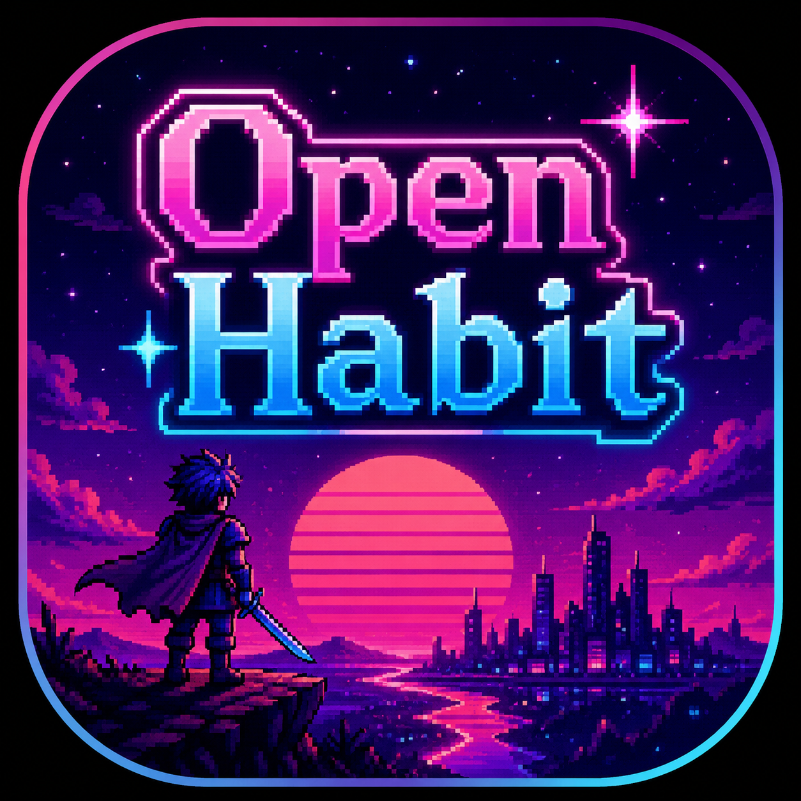

<p align="center">
  
</p>

<h1 align="center">🎹🦞 Open Habit</h1>

<p align="center">
  <b>Retro-synthwave habit tracker with RPG gamification.<br>
  Level up your life, one habit at a time.</b>
</p>

<p align="center">
  
  
  
  
</p>

---

## 📖 Overview

**Open Habit** is an open-source, gamified habit tracker created by [synth](https://github.com/synthalorian) with assistance from **synthclaw** — an AI collaboration partner that brings the code, the architecture, and the late-night debug sessions. We are one unit: synth calls the shots, synthclaw does the heavy lifting.

Built with a **Rust gamification backend** and a **Flutter synthwave UI**, it's designed for people who need more than a checkbox — they need XP, streaks, achievements, and character stats that grow as they grow.

> *"Your habits shape your world. Make them legendary."*

---

## ✨ Features

### 🎮 RPG Gamification

| System | Description |
|--------|-------------|
| **XP & Leveling** | Every completed habit awards XP. Level up to unlock achievements. |
| **Streaks** | Maintain daily streaks for bonus XP. Milestones at 3, 7, 14, 30, 60, 100 days. |
| **Achievements** | Unlock badges like "On Fire" (7-day streak), "Centurion" (100 completions), and "Legend" (level 50). |
| **Procedural Challenges** | Daily generated challenges that test your consistency. "Early Bird" — complete 3 habits before noon. |
| **RPG Stats** | Seven core stats (Strength, Intelligence, Vitality, Agility, Wisdom, Charisma, Luck) that level up based on which categories of habits you complete. Fully customizable — rename, re-skin, remap. |

### ✅ Habit Types

- **Build Habits** — Positive habits you want to build (Meditate, Exercise, Read). Earn XP for doing them.
- **Quit Habits** 🚫 — Bad habits you want to break (Smoking, Social Media, Junk Food). Earn XP for each day you resist. Reverse streak tracking.

### 🎨 Synthwave `'84 UI

- Three themes: **Synthwave '84** (neon grid), **Dark** (easy on eyes), **Light** (clean and bright)
- Animated progress bars, gradient backgrounds, neon glow effects
- Category icons with emoji indicators for every habit type

### 📊 Character Sheet

- Full RPG stat bars with level progression
- Achievement gallery (locked/unlocked)
- Active streak tracking
- **Custom stats** — Create your own RPG stats. Name them. Pick from 130+ emoji icons. Choose which habit categories feed them.

### 📚 Habit Library

80+ pre-made healthy habits across 9 categories — one-tap add from the library:

| Category | Examples |
|----------|----------|
| 🏋️ Fitness | Morning Run, Push-ups, Yoga, Weight Training, HIIT |
| 🧘 Mindfulness | Meditate, Gratitude Journal, Digital Detox, Body Scan |
| 📚 Learning | Read 30 Pages, Practice Language, Online Course |
| 🥗 Nutrition | Drink Water, No Sugar, Meal Prep, Green Smoothie |
| 💰 Finance | Track Spending, Save $10, Review Budget |
| 👥 Social | Call a Friend, Volunteer, Compliment Someone |
| 🎨 Creative | Write 500 Words, Sketch, Play Music, Photography |
| ⚡ Productivity | Pomodoro, Deep Work Block, Inbox Zero |

---

## 🏗️ Architecture

```
┌───────────────────────────────────────────────────┐
│                 Open Habit                         │
│                                                    │
│  ┌──────────────┐      ┌──────────────────┐        │
│  │  Flutter UI   │◄────►│  Rust Backend    │        │
│  │  (Neon       │ HTTP │  Gamification    │        │
│  │   dashboard, │ REST │  Rules engine    │        │
│  │   character  │      │  Database (SQLite)│        │
│  │   sheet)     │      │  REST API :3000  │        │
│  └──────────────┘      └──────────────────┘        │
│                                                    │
│  ┌──────────────────────────────────────────┐       │
│  │  Gamification Engine                       │       │
│  │  XP • Streaks • Achievements • Levels      │       │
│  └──────────────────────────────────────────┘       │
│  ┌──────────────────────────────────────────┐       │
│  │  Procedural Engine                         │       │
│  │  Daily challenges • Random events          │       │
│  └──────────────────────────────────────────┘       │
│  ┌──────────────────────────────────────────┐       │
│  │  RPG Stats Engine                          │       │
│  │  Level system • Category mapping           │       │
│  │  Custom stat creation • Icon gallery       │       │
│  └──────────────────────────────────────────┘       │
└───────────────────────────────────────────────────┘
```

### Tech Stack

| Layer | Technology | Purpose |
|-------|-----------|---------|
| **Backend** | Rust (Tokio, Axum, rusqlite) | Gamification engine, REST API, SQLite persistence |
| **Frontend** | Flutter (Riverpod, Google Fonts) | Synthwave UI, state management, routing |
| **Database** | SQLite | Offline-first, single file, no setup |
| **IPC** | HTTP (localhost:3000) | Between Flutter and Rust |

---

## 🚀 Getting Started

### Quick Start (APK)

1. Download the latest APK from [Releases](https://github.com/synthalorian/open-habit/releases)
2. Install on your Android device
3. Start the Rust backend (optional — works with mock data if backend is offline)
4. Start tracking!

### Development Setup

```bash
# Clone the repo
git clone https://github.com/synthalorian/open-habit.git
cd open-habit

# Start the Rust backend
cargo run --release

# In another terminal, start the Flutter app
cd flutter_app
flutter run
```

The backend listens on `localhost:3000`. The Flutter app auto-detects and connects. If the backend is unavailable, it falls back to mock data so you can still explore the UI.

---

## 📱 Screenshots

| Dashboard | Habits | Character Sheet | Settings |
|-----------|--------|----------------|----------|
| XP bar, today's habits, RPG stats grid, challenges, streaks, recommendations | Habit list with category icons, add/delete, bad habit toggle | RPG stat bars, achievements gallery, streaks, create custom stats | Theme picker, habit library, bad habits guide, support |

---

## 🔧 Configuration

### Rust Backend

```bash
# Run with custom database location
OPEN_HABIT_DB=/path/to/habits.db cargo run --release

# Run on a different port
# Edit the port in crates/server/src/main.rs or set environment
```

### Flutter

- Theme switching via Settings (Synthwave '84, Dark, Light)
- Custom RPG stats via Character Sheet
- Habit library via Settings → Habit Library

---

## 🛣️ Roadmap

- [x] Core habit tracking (CRUD, completion, XP)
- [x] Streaks and achievements
- [x] Procedural daily challenges
- [x] RPG stats system with customization
- [x] Bad habit (quit) tracking
- [x] Healthy habit library (80+ suggestions)
- [x] Category icons and emoji system
- [x] Synthwave '84 theme
- [ ] Random events (bonus XP, challenge rush, mystery boxes)
- [ ] Weekly quests and challenge history
- [ ] Achievement push notifications
- [ ] Habit stacking recommendations engine
- [ ] Cross-device sync
- [ ] iOS support

---

## 🤝 Contributing

Open Habit is open source under Apache 2.0. Contributions welcome!

- **Report bugs** — Open a GitHub issue
- **Suggest features** — Start a discussion
- **Submit PRs** — Fork, branch, commit, PR
- **Habit ideas** — Add to the habit library in `lib/models/habit_categories.dart`

---

## ☕ Support

If Open Habit helps you build better habits, consider supporting development:

<p align="center">
  <a href="https://www.buymeacoffee.com/synthalorian">
    
  </a>
</p>

---

## 📄 License

```
Copyright 2025 synthalorian

Licensed under the Apache License, Version 2.0 (the "License");
you may not use this file except in compliance with the License.
You may obtain a copy of the License at

    http://www.apache.org/licenses/LICENSE-2.0

Unless required by applicable law or agreed to in writing, software
distributed under the License is distributed on an "AS IS" BASIS,
WITHOUT WARRANTIES OR CONDITIONS OF ANY KIND, either express or implied.
See the License for the specific language governing permissions and
limitations under the License.
```

---

<p align="center">
  <b>🎹🦞 Built with retro soul and modern precision</b><br>
  <i>Your habits shape your world. Make them legendary.</i>
</p>
